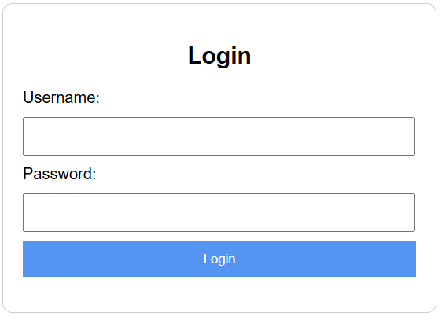
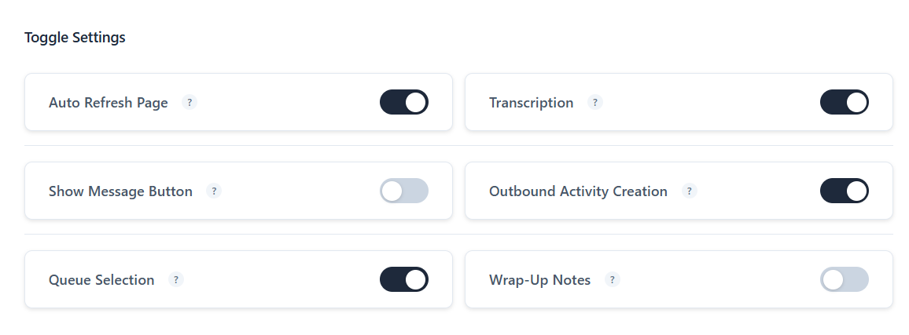
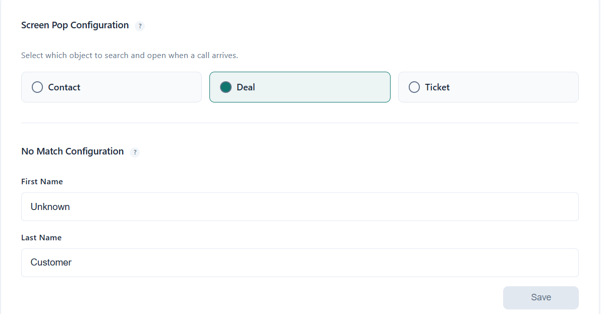
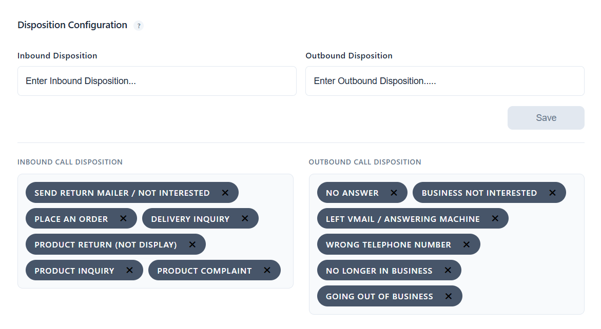
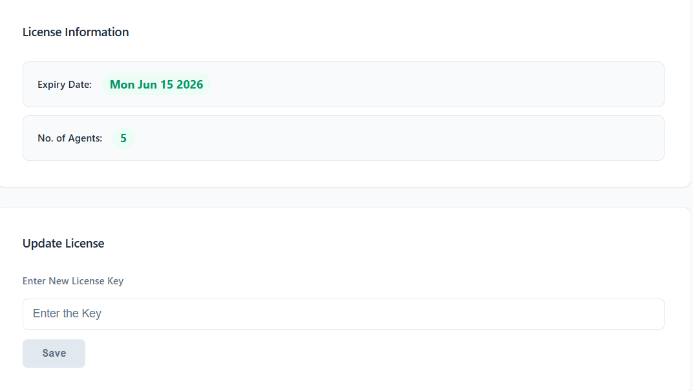
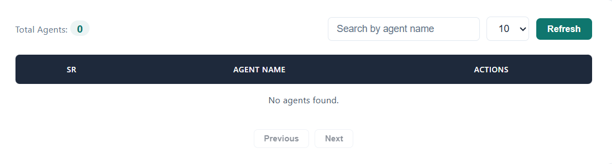

# Admin Configuration Guide

This guide covers the connector's admin portal, used to connect HubSpot, tune agent behavior, manage dispositions, and handle licensing. It assumes the connector has already been [deployed](../deployment/deployment-guide.md).

## Accessing the admin portal

1. Navigate to your connector's bare FQDN, e.g. `https://connector.yourcompany.com`.
2. Log in with the admin credentials provided during deployment.
<figure class="doc-figure" markdown="1">
{ width="440" }
</figure>

The admin portal has four sections, accessible from the top navigation: **Home** (release notes), **Settings**, **License Details**, and **Logged-in Agents**.

## Connecting HubSpot

If the app hasn't been installed in your HubSpot portal yet, click **Install HubSpot** in the admin header. This starts the same OAuth install flow described in the [Deployment Guide](../deployment/deployment-guide.md#6-post-deployment-configuration-hubspot) — you'll be asked to approve the permissions the connector needs (contacts, deals, tickets, companies, calls, and communications).

## Toggle settings

From **Settings**, four toggles control agent-facing behavior:

| Toggle | What it does |
|---|---|
| **Outbound Activity Creation** | When on, an activity is created in HubSpot for anonymous outbound calls (calls not linked to a known contact). When off, no activity is created for those calls. |
| **Transcription** | Enables or disables call/chat transcription. When on, transcripts are attached to the HubSpot engagement after the call ends. |
| **Queue Selection** | When on, agents can choose a queue before placing an outbound call. When off, that option is hidden and outbound calls use the default queue. |
| **Wrap-Up Notes** | When on, agents are shown a disposition and note form after each call ends (see the [Agent User Guide](../user-guides/agent-guide.md#wrap-up-dispositions-and-notes)). When off, calls are logged automatically with no wrap-up step. |

<figure class="doc-figure" markdown="1">
{ width="640" }
</figure>

## Screenpop configuration

Under **Screen Pop Configuration**, choose which HubSpot object type the connector searches and opens when a call or chat arrives: **Contact** or **Deal**. This determines what agents land on during screenpop.
<figure class="doc-figure" markdown="1">
{ width="640" }
</figure>

### No-match configuration

If an inbound number doesn't match any existing HubSpot contact, the connector creates one automatically and displays a placeholder name until the agent (or a later HubSpot update) fills in the real details. Set the **First Name** and **Last Name** used for that placeholder here — the default is "John Doe" if left blank.

## Engagement configuration

### Attributes

Under **Engagement Configuration**, enter any AWS Connect contact attributes you want captured and shown in the HubSpot call description — comma-separated (e.g. `queue_name, campaign_id`). Once saved, these appear in the call description automatically after each call ends.

### Dispositions

Under **Disposition Configuration**, enter your inbound and outbound disposition lists, comma-separated (e.g. `Resolved, Follow-up needed, No answer` for inbound). These populate the wrap-up dropdown agents see after a call — inbound and outbound calls have separate lists. Existing dispositions are listed below the form and can be removed individually.
<figure class="doc-figure" markdown="1">
{ width="640" }
</figure>

## License management

Under **License Details**:

- **License Information** shows your current license status — customer name, HubSpot portal, expiry, and seat count.
- **Update License** lets you paste in a new license key if you've received a renewal or seat change from Octave Bytes.
<figure class="doc-figure" markdown="1">
{ width="640" }
</figure>

## Managing logged-in agents

**Logged-in Agents** lists every agent currently signed in, with their name, username, and agent ID. Use **Refresh** to update the list, and use the row actions to remove a stale or unwanted session — useful if an agent's device was lost or they're locked out and need a clean re-login.
<figure class="doc-figure" markdown="1">
{ width="640" }
</figure>

## Next steps

- Rolling out to your first agents? Point them to the [Agent Setup Guide](../deployment/agent-setup.md).
- Running into an issue? See [Troubleshooting & FAQ](../support/troubleshooting.md).
