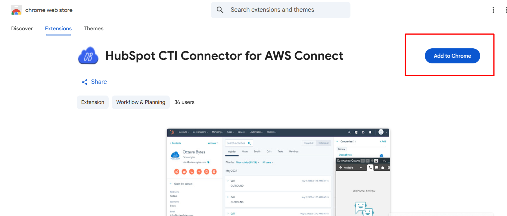
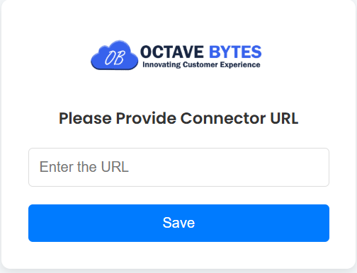
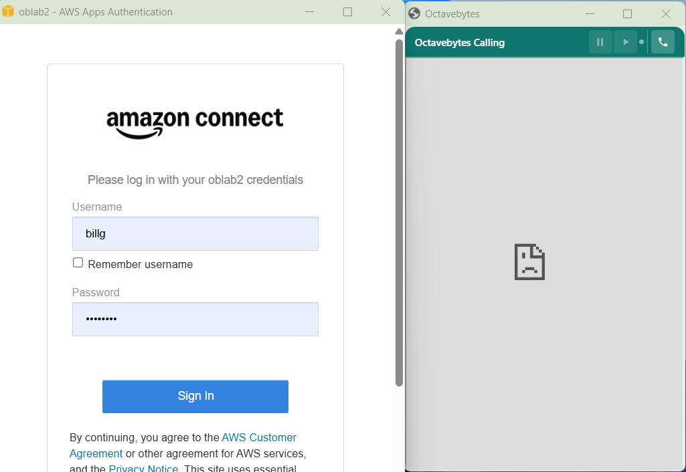

# Agent Setup Guide

This guide is for individual agents setting up the HubSpot CTI Connector on their own machine, **after** the connector has already been deployed and installed in your HubSpot portal by your admin/IT team (see the [Deployment Guide](deployment-guide.md)). You only need to do this once per browser profile.

## Prerequisites

- The connector has already been deployed and its URL (FQDN) shared with you by your admin, e.g. `https://connector.yourcompany.com`.
- The app has already been installed in your HubSpot portal.
- You have a valid AWS Connect agent login for your contact center.
- Google Chrome is installed. If your organization manages Chrome centrally, confirm with IT that installing extensions is permitted, or that this extension is allow-listed.

## Step 1 — Install the Chrome extension

1. Open the **HubSpot CTI Connector for AWS Connect** listing on the Chrome Web Store.
2. Click **Add to Chrome**.
<figure class="doc-figure" markdown="1">
{ width="640" }
</figure>

## Step 2 — Configure your connector URL

The first time you install the extension, it will prompt you for your connector URL.

1. Enter your connector's FQDN with `/connector.html` appended, e.g.:

   ```
   https://connector.yourcompany.com/connector.html
   ```

2. Click **Save**.

> Appending `/connector.html` to the FQDN is mandatory for the extension to function correctly. Don't use the bare FQDN here — that's a separate URL used only during the one-time HubSpot app install.
<figure class="doc-figure" markdown="1">
{ width="540" }
</figure>


You can revisit this screen later from `chrome://extensions` → HubSpot CTI Connector → **Extension options**, if you ever need to change it.

## Step 3 — Allow pop-ups

The connector opens your softphone in a pop-up window. The first time you open HubSpot with the extension active, Chrome will block this pop-up by default.

1. Click the blocked pop-up icon in the Chrome address bar.
2. Select **"Always allow pop-ups and redirects from [connector URL]."**
3. Click **Done**, then reload the page.

<figure class="doc-figure" markdown="1">
{ width="640" }
</figure>

## Step 4 — Log in to your softphone

1. Open HubSpot and click the extension icon, or navigate to a HubSpot record — the connector popup should open automatically.
2. When prompted, log in with your AWS Connect agent credentials.
3. Once logged in, your agent status and softphone controls will appear in the connector window.

<figure class="doc-figure" markdown="1">
{ width="640" }
</figure>


## You're ready

Once logged in, you should see:

- The softphone controls in the connector popup.
- Dial and message buttons appearing next to phone number fields in HubSpot.

For day-to-day usage, see the [Agent User Guide](../user-guides/agent-guide.md).

## Troubleshooting

See the [Troubleshooting & FAQ](../support/troubleshooting.md) guide if the extension won't connect, pop-ups stay blocked, or you can't log in.
