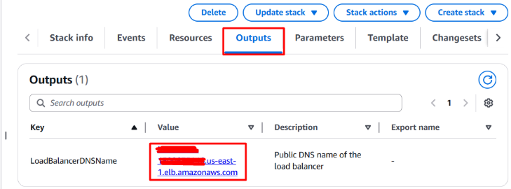
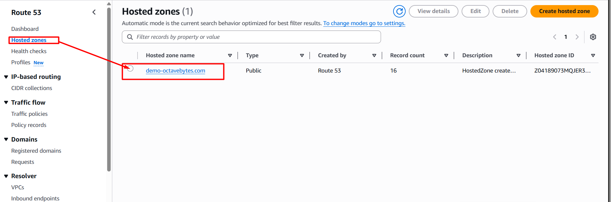
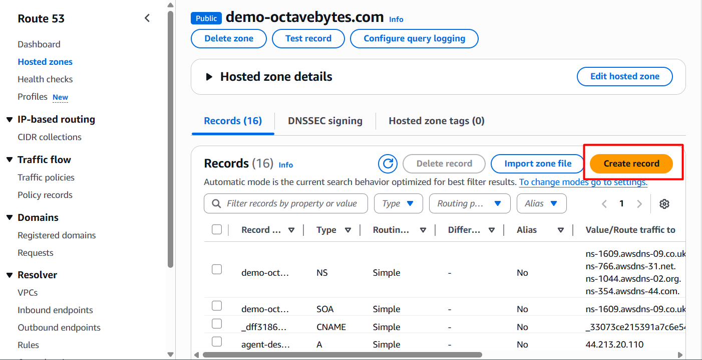
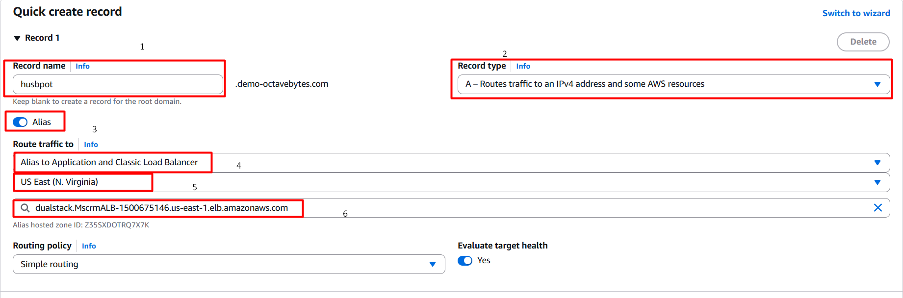
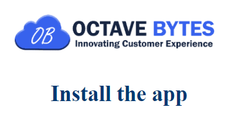
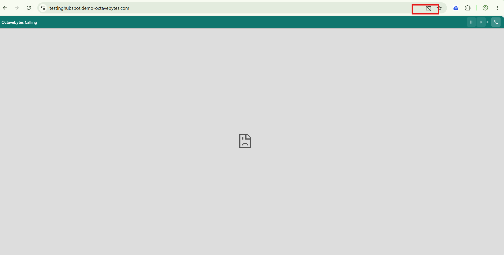
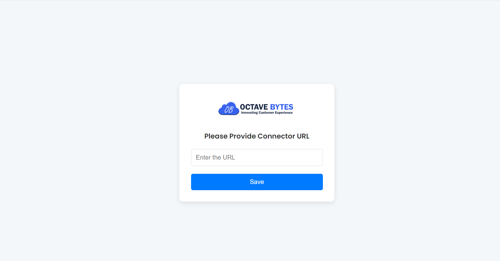

# HubSpot CTI Connector — Automated Deployment Guide

{ width="220" }

**Version 3.2 | 16 July 2026**
Prepared for Customer Deployment Teams

## Document Control

### Version History

| Version | Issue Date | Status | Reason for Change |
|---|---|---|---|
| 3.0 | 16-July-2026 | Draft | First version |
| 3.1 | 16-July-2026 | Draft | Removed architecture section; added SSL certificate setup, stack parameter reference, IAM acknowledgment step, DNS propagation and troubleshooting guidance; clarified pop-up and extension URL steps |
| 3.2 | 16-July-2026 | Draft | Verified all stack parameters directly against the CloudFormation template; corrected prerequisites and parameter table; added Security Considerations section (open SSH, hardcoded credentials, AppBaseURL ambiguity) |

---

## 1. Overview

This guide explains how to deploy the Octave Bytes HubSpot CTI Connector using the provided AWS CloudFormation template, and how to complete the required post-deployment configuration in HubSpot and Google Chrome.

The deployment is split into four stages:

- Requesting and validating an SSL certificate for your connector domain.
- Deploying the connector infrastructure to AWS using CloudFormation.
- Configuring DNS so the connector is reachable at a secure, custom domain.
- Completing post-deployment setup in HubSpot and installing the Chrome extension.

### 1.1 Prerequisites

Before starting the deployment, please confirm the following:

- An AWS account with permissions to create CloudFormation stacks, IAM roles, VPC/networking resources, and EC2 instances.
- An EC2 key pair already created in the AWS region you'll deploy to, for administrative SSH access to the connector instance.
- Access to a HubSpot account with necessary permission to install the app in HubSpot CRM.
- Access to your DNS provider (e.g. AWS Route 53, GoDaddy, or similar) to create certificate-validation and domain records.
- The domain/FQDN you intend to use for the connector (e.g. `connector.yourcompany.com`), decided in advance.
- Details of your existing Amazon Connect instance: alias/name, instance ID, the AWS region it runs in, and its full instance URL (e.g. `https://your-alias.my.connect.aws`).
- The name of your existing S3 bucket used for Amazon Connect call recordings (this bucket must already exist — the stack does not create it).
- Your AWS Account ID for the account you are deploying into (used directly as a stack parameter).
- Google Chrome installed for agents, with permission to install extensions (see [Section 7](#7-install-the-chrome-extension) if Chrome is centrally managed by IT).

> **Before you begin**
> Share your AWS Account ID and HubSpot Portal ID with the Octave Bytes team before starting the deployment, and wait for confirmation that access has been granted. The CloudFormation template is stored in an Amazon S3 bucket owned by Octave Bytes, and your AWS Account ID is required so we can grant your account permission to access it — starting [Section 4](#4-deploy-the-cloudformation-stack) before access is confirmed will result in an Access Denied error.

---

## 2. Request an SSL Certificate (AWS Certificate Manager)

The connector's load balancer requires a validated SSL/TLS certificate to serve traffic over HTTPS. This certificate must be requested and validated before you deploy the CloudFormation stack in Section 4, because the stack requires the certificate's ARN as an input parameter.

1. In the AWS Management Console, open **AWS Certificate Manager (ACM)** in the same AWS region where you plan to deploy the connector stack.
2. Choose **Request a certificate**, then **Request a public certificate**.
3. Enter the fully qualified domain name (FQDN) you plan to use for the connector, e.g. `connector.yourcompany.com`.
4. Select **DNS validation** as the validation method, then request the certificate.
5. Open the new certificate's details page and copy the CNAME name and value provided for validation.
6. Add this CNAME record in your DNS provider (e.g. Route 53). This is a separate, one-time validation record — not the same as the A record you will create in Section 5.
7. Wait for the certificate status to change from **Pending validation** to **Issued**. This typically takes a few minutes, but can take several hours depending on your DNS provider.
8. Copy the certificate's **ARN** (Amazon Resource Name) — you will need it as a stack parameter in Section 4.

> **Don't skip ahead**
> Do not proceed to Section 4 until the certificate status shows **Issued**. Attempting to deploy the stack with a pending or unvalidated certificate ARN will cause the stack creation to fail.

---

## 3. CloudFormation Template

Deploy the connector using the following CloudFormation template:

```
https://cf-template-connector.s3.us-east-1.amazonaws.com/hubspot/connector.yml
```

You may deploy the stack in any AWS region that suits your organization; it does not need to match the region in which this template is hosted. Whichever region you choose, use the same region for the ACM certificate in Section 2 and the Route 53 alias in Section 5. Make a note of your chosen region now.

---

## 4. Deploy the CloudFormation Stack

### 4.1 Required Stack Parameters

Have the following information ready before you start the wizard. This list reflects the current CloudFormation template; Octave Bytes will confirm any account-specific values (such as the ECR image URL) when granting you access.

| Parameter | What to enter |
|---|---|
| `KeyName` | An existing EC2 key pair in the region you're deploying to, for SSH access to the connector instance. |
| `ConnectAlias` | Your Amazon Connect alias/name only — not the full URL. |
| `ConnectRegion` | The AWS region your Amazon Connect instance runs in. This can be different from the region you deploy this stack into. |
| `ConnectInstanceID` | Your Amazon Connect instance ID (GUID format). |
| `ConnectRecordingBucket` | Name of your existing S3 bucket used for Amazon Connect call recordings (must already exist). |
| `HubspotPortalId` | Your numeric HubSpot Portal/Hub ID. |
| `ECRRepoUrl` | `747926693930.dkr.ecr.us-east-1.amazonaws.com/hubspot-connector:baserelease` |
| `AppBaseURL` | Add your FQDN here. For example `https://connector.yourcompany.com` |
| `CustomerName` | Your company name, used for license and display labeling. |
| `CALLTRANSCRIPT` | `ON` or `OFF` — enables or disables call transcript capture. Default: `ON`. |
| `InstanceType` | EC2 size for the connector instance: select **t3.medium**. |
| `AccountIdForPolicy` | Your own AWS Account ID — the account you are deploying into. |
| `ACMCertificateArn` | ARN of the validated ACM certificate from Section 2. |
| `ConnectURL` | Full Amazon Connect instance URL (distinct from `ConnectAlias`), e.g. `https://your-alias.my.connect.aws`. |
| `SSOURL` | Your Auth0 URL. |
| `HubspotDataCenter` | Your HubSpot data center prefix: `app`, `app-na1`, `app-na2`, or `app-eu1`. Default: `app-na2`. |

### 4.2 Deployment Steps

1. Confirm you have received access-granted confirmation from Octave Bytes (Section 1.1) and that your ACM certificate status is **Issued** (Section 2).
2. Sign in to the AWS Management Console.
3. Open AWS CloudFormation, in the same region noted in Section 3.
4. Select **"Create stack (With new resources – standard)."**
5. Choose an existing template.
6. Select **Amazon S3 URL**.
7. Enter the template URL provided in Section 3.
8. Continue through the CloudFormation wizard.
9. Provide the required stack parameters listed in Section 4.1.
10. On the review page, check **"I acknowledge that AWS CloudFormation might create IAM resources."** This checkbox must be selected or the Create stack button will remain disabled, since the template creates an IAM role for the connector instance.
11. Choose **Create stack** and wait for the status to reach `CREATE_COMPLETE`. This typically takes 10–15 minutes.

> **If the stack fails**
> If the stack status shows `CREATE_FAILED` or `ROLLBACK_COMPLETE`, open the stack's Events tab to identify which resource failed and why. Delete the failed stack before retrying. If the reason isn't clear, contact Octave Bytes support with the error message from the Events tab rather than retrying repeatedly.

Once the stack finishes deploying, open the **Outputs** tab and copy the load balancer URL — you'll need it in the next section to configure DNS.

<p align="center" markdown="1">
{ width="640" }

*Figure 1 — Load balancer URL shown in the CloudFormation stack Outputs tab*
</p>

---

## 5. Configure DNS

This is the second of two DNS touchpoints in this guide — the first was the certificate-validation CNAME record in Section 2. Here, you'll point your chosen FQDN at the load balancer using an A record (Alias). The steps below use AWS Route 53; the process is similar with other DNS providers such as GoDaddy.

1. Open Route 53 (or your DNS provider) and select the hosted zone for your domain.
2. Click **Create record**.
3. Enter the record name for your chosen FQDN (e.g. `connector`) and set the record type to **A**.
4. Enable **Alias**, then set "Route traffic to" to **Alias to Application and Classic Load Balancer**.
5. Select the AWS region you deployed the stack in (Section 3) — not necessarily `us-east-1` — then paste the load balancer URL from Section 4.
6. Leave **Evaluate target health** set to **Yes** (default). This tells Route 53 to only route traffic to the load balancer while its health checks are passing.
7. Click **Create records**.

This will point your subdomain to the load balancer and secure your connector URL, redirecting HTTP traffic to HTTPS automatically.

<p align="center" markdown="1">
{ width="640" }

*Figure 2 — Selecting the hosted zone in Route 53*
</p>

<p align="center" markdown="1">
{ width="500" }

*Figure 3 — Creating a new DNS record*
</p>

<p align="center" markdown="1">
{ width="640" }

*Figure 4 — Configuring the A record as an alias to the Application Load Balancer (the record name and domain shown are illustrative — substitute your own subdomain)*
</p>

DNS changes can take anywhere from a few minutes up to 48 hours to propagate fully, though most updates are visible within 15–30 minutes. Confirm the FQDN resolves correctly (for example, by opening it in a browser) before moving on to Section 6.

Once this is complete, share the resulting Fully Qualified Domain Name (FQDN) — for example, `connector.yourcompany.com` — with the Octave Bytes team before proceeding to the next section.

---

## 6. Post-Deployment Configuration (HubSpot)

### 6.1 Install the App

1. Log in to HubSpot in an adjacent browser tab, using the appropriate HubSpot account (with required permissions) for the correct portal (the one whose Portal ID you shared with Octave Bytes).
2. In a new tab, navigate to your connector's bare FQDN (e.g. `https://connector.yourcompany.com`) — with no additional path.
3. You will be prompted to **Install the app**. Click **Install** (or **Grant access**) and approve the requested HubSpot permissions when prompted.
4. If you land on the wrong HubSpot portal, log out and sign back in with the correct account before retrying.

<p align="center" markdown="1">
{ width="360" }

*Figure 5 — Install the app prompt*
</p>

### 6.2 Allow Pop-ups

The first time each agent opens the connector FQDN, Chrome blocks the connector's calling pop-up window by default. Each agent must allow it once, per browser profile:

- Click the blocked pop-up icon in the Chrome address bar (a small window icon).
- Select **"Always allow pop-ups and redirects from [connector URL]."**
- Click **Done**.
- Reload the page.

<p align="center" markdown="1">
{ width="640" }

*Figure 6 — Allowing pop-ups for the connector URL in Chrome*
</p>

---

## 7. Install the Chrome Extension

> **Two different URLs are used in this guide**
> The bare FQDN (e.g. `https://connector.yourcompany.com`) is used once, in Section 6.1, to install the app in HubSpot. The FQDN with `/connector.html` appended is a separate address used only when configuring the Chrome extension below. Do not interchange the two.

If your organization manages Chrome centrally, confirm with your IT team that installing extensions from the Chrome Web Store is permitted, or that this extension is allow-listed, before proceeding.

Each agent needs to install the HubSpot CTI Connector Chrome extension:

**Chrome Web Store:** HubSpot CTI Connector Extension

After installing the extension, configure it with your connector URL. When prompted, enter the URL in the following format, appending `/connector.html` to your FQDN:

```
https://connector.yourcompany.com/connector.html
```

Appending `/connector.html` to the FQDN is mandatory for the extension to function correctly.

<p align="center" markdown="1">
{ width="420" }

*Figure 7 — Entering the connector URL in the Chrome extension*
</p>

---

## 8. Deployment Complete

Once the connector URL has been entered and saved in the Chrome extension, the HubSpot CTI Connector installation is complete. Before rolling out to your full team, confirm the following:

- The connector FQDN loads securely over HTTPS.
- The app has been installed successfully in your HubSpot portal.
- Pop-ups are allowed for the connector URL in each agent's browser.
- The Chrome extension is installed and configured with the correct connector URL (including `/connector.html`).

### 8.1 Troubleshooting Quick Reference

| Symptom | Likely cause / next step |
|---|---|
| Stack creation fails or rolls back | Check the stack's Events tab for the failing resource; confirm all Section 4.1 parameters are correct; contact Octave Bytes with the error message. |
| Connector FQDN doesn't resolve | DNS may still be propagating (up to 48 hours); re-check the A record in Section 5. |
| "Install the app" doesn't appear or fails | Confirm you're logged into the correct HubSpot portal as Super Admin; confirm the FQDN is resolving first. |
| Calling window doesn't open | Confirm pop-ups are allowed for the connector URL (Section 6.2). |
| Extension can't connect | Confirm the URL entered ends in `/connector.html` and uses `https://`. |

> **Need help?**
> If you run into any issues during deployment, please reach out to the Octave Bytes support team with your AWS Account ID and HubSpot Portal ID on hand so we can assist you quickly.
