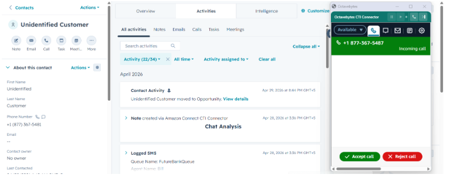
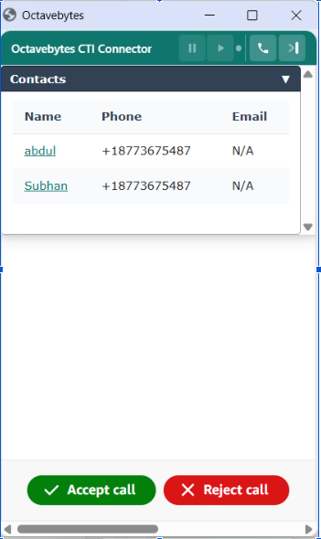
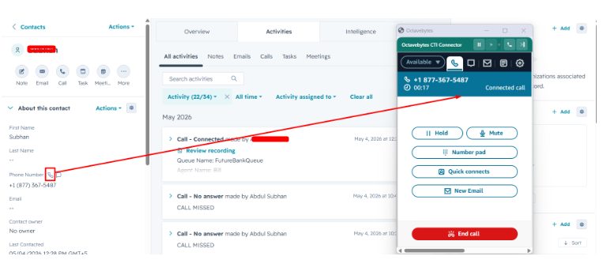
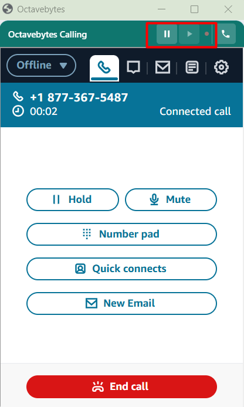
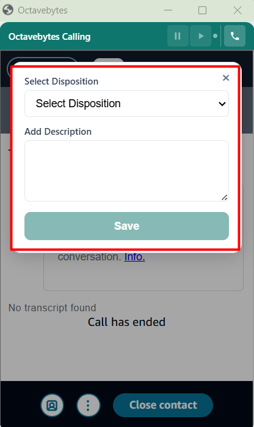

# Agent User Guide

This guide covers day-to-day use of the HubSpot CTI Connector once it's [installed and configured](../deployment/agent-setup.md).

## Your workspace

While working, you'll have two things open side by side:

- **HubSpot**, where you view and update records as usual.
- **The connector popup window**, which runs your AWS Connect softphone (CCP). It opens automatically when you access HubSpot with the extension active, and stays open in the background.

The connector window has two sizes — a compact **standard view** for everyday softphone controls, and an **extended view** for when you need more space (e.g. the outbound dialer panel). You can toggle between them from the connector window.

## Inbound calls, chats, and WhatsApp (screenpop)

When a voice call, chat, or WhatsApp message comes in through AWS Connect, the connector automatically looks up the caller's phone number and opens the right record in your HubSpot tab — this is called **screenpop**. You don't need to do anything for it to happen.

There are three possible outcomes:

| Outcome | What happens |
|---|---|
| **One match found** | HubSpot automatically navigates to that contact (or their associated deal, depending on your admin's configuration) |
| **Multiple matches found** | A short picker appears in the connector window listing each matching contact (with name and email) — pick the right one and HubSpot will navigate to it |
| **No match found** | A new HubSpot contact is created automatically using the phone number, so the call is still logged against a record |

<figure class="doc-figure" markdown="1">
{ width="640" }
</figure>
<figure class="doc-figure" markdown="1">
{ width="340" }
</figure>

## Outbound click-to-dial

You can call any phone number directly from HubSpot without opening the softphone dialer manually:

1. Find a phone number field on a contact, deal, company, or ticket record — a small **dial button** appears next to it automatically.
2. Click the dial button. The call is placed through your softphone, and the engagement is automatically linked to the record you dialed from.
<figure class="doc-figure" markdown="1">
{ width="640" }
</figure>

Dial buttons work on phone and mobile fields labeled in several languages (English, Spanish, etc.), so this works the same way across supported locales.

You can also place outbound calls manually from the connector window's dialer panel without starting from a HubSpot record.

## WhatsApp messaging

If your account has WhatsApp enabled, you can message any contact directly from HubSpot the same way you dial — see the [WhatsApp Messaging Guide](whatsapp-messaging.md) for the full walkthrough.

## During a call

- **Recording pause/resume** — if call recording is enabled for your contact center, use the pause/resume control in the softphone before discussing anything that shouldn't be recorded (e.g. payment details), then resume when you're done.

<figure class="doc-figure" markdown="1">
{ width="340" }
</figure>

## Wrap-up: dispositions and notes

If your admin has enabled wrap-up, you'll see a short form after each call ends (during ACW — after-call work):

1. Choose a **disposition** from the list your admin configured (e.g. *Resolved*, *Follow-up needed*, *No answer*) — inbound and outbound calls have separate disposition lists.
2. Optionally add a **note** describing the call.
3. Submit. Your disposition and note are appended to the call's description in HubSpot, so anyone reviewing the record later can see the outcome.
<figure class="doc-figure" markdown="1">
{ width="340" }
</figure>

If wrap-up isn't enabled for your account, the call is still logged automatically — you just won't see this form.

## What gets logged automatically

You don't need to manually create call or chat records — the connector does this for you after each interaction ends:

- A **call** (voice) or **communication** (chat/WhatsApp) record is created on the matched HubSpot contact.
- It's associated with the relevant deal, ticket, or company, where applicable.
- The recording URL is attached, if recording is enabled.
- A transcript is attached, if your admin has enabled call transcription.
- Your selected disposition and note are included, if wrap-up is enabled.

If a call ends with no contact match resolved (for example, a multi-match picker left unanswered), no HubSpot activity is created for it — this is expected behavior, not an error.

## Next steps

- Sending or receiving WhatsApp messages? See the [WhatsApp Messaging Guide](whatsapp-messaging.md).
- Something not working as expected? See [Troubleshooting & FAQ](../support/troubleshooting.md).
