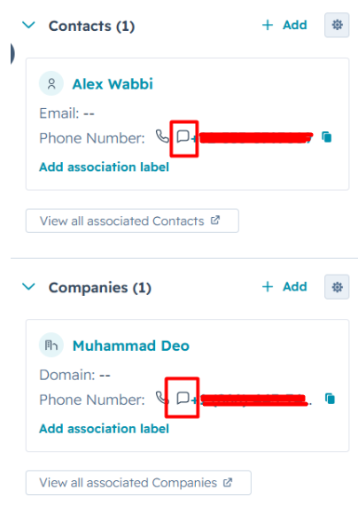
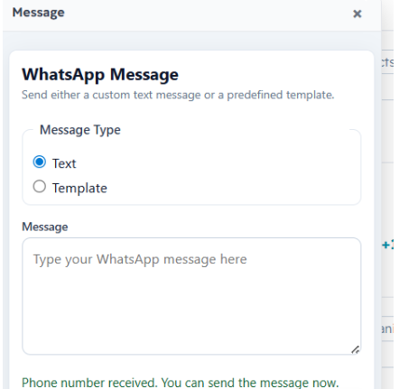
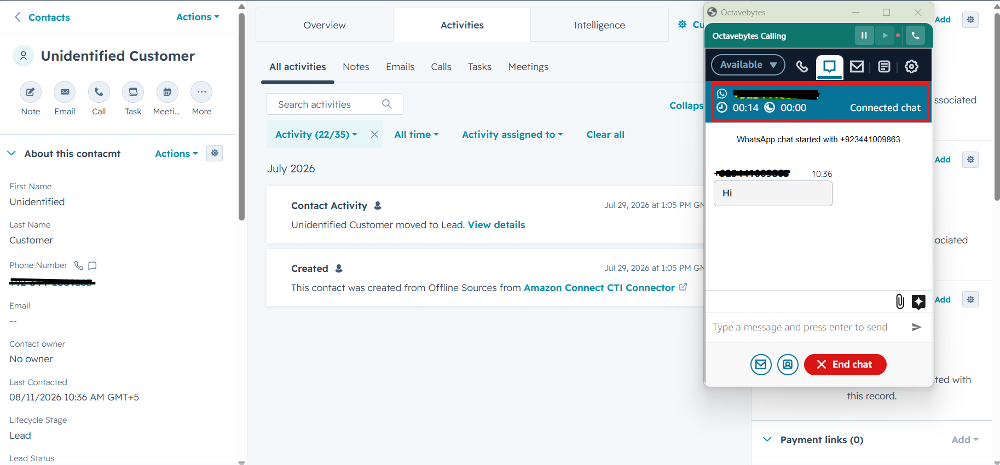

# WhatsApp Messaging Guide

If your account has WhatsApp enabled, agents can send and receive WhatsApp messages without leaving HubSpot. This guide covers both directions.

## Sending an outbound WhatsApp message

1. Find a phone number field on a contact, deal, company, or ticket record in HubSpot.
2. Click the **message button** next to the field — a WhatsApp panel opens as a popover.
<figure class="doc-figure" markdown="1">
{ width="340" }
</figure>

3. Choose how you want to send:
   - **Template** — pick from your account's approved WhatsApp message templates. If the template has variables (e.g. a customer name or order number), fill them in before sending.
   - **Free text** — type a message directly. Free-text messages are only deliverable within an active WhatsApp conversation window; outside that window, WhatsApp requires an approved template.
4. Click **Send**.
<figure class="doc-figure" markdown="1">
{ width="340" }
</figure>

## What happens after you send

- The message is delivered through your account's WhatsApp provider.
- A **communication** engagement is created on the matched HubSpot contact automatically, so the message is visible in the contact's timeline alongside calls and notes.
- If HubSpot can't be reached immediately, the message is still sent to the customer and the HubSpot record is updated shortly after — you don't need to retry anything.

## Receiving inbound WhatsApp

Inbound WhatsApp messages arrive through the same AWS Connect chat channel as regular chat, so they behave just like an inbound chat for screenpop purposes:

- The connector looks up the sender's phone number and opens the matching HubSpot contact automatically.
- If there's no match, a new contact is created.
- If there are multiple matches, you'll see the same picker used for inbound calls — see the [Agent User Guide](agent-guide.md#inbound-calls-chats-and-whatsapp-screenpop) for details.

<figure class="doc-figure" markdown="1">
{ width="640" }
</figure>

## Troubleshooting

See [Troubleshooting & FAQ](../support/troubleshooting.md) if a message won't send, a template doesn't appear, or the WhatsApp panel doesn't open.
